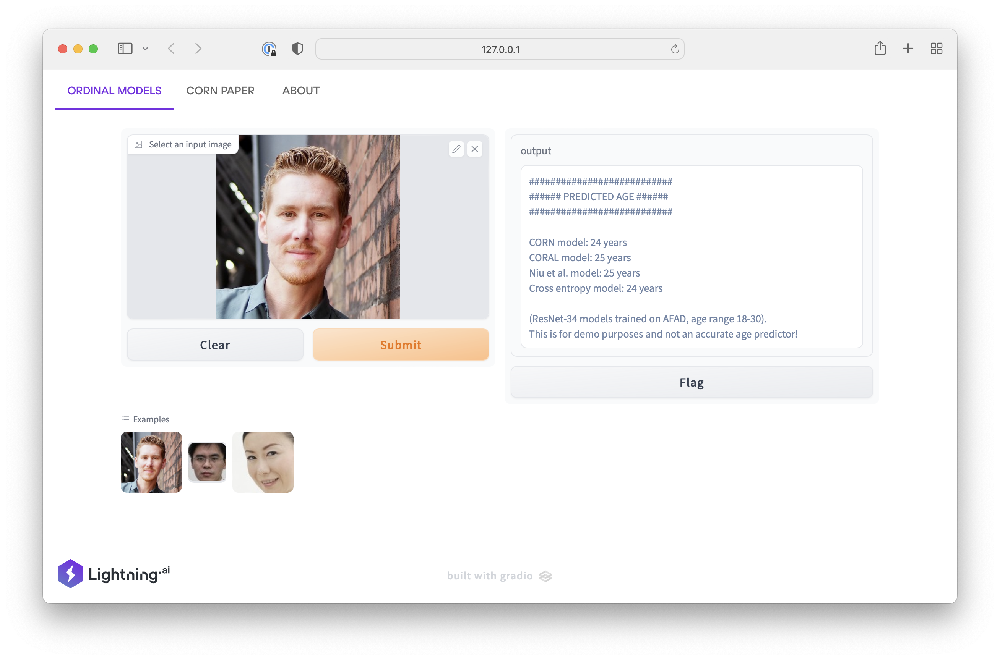

Use the following code to run this [Lightning](https://lightning.ai) App locally:


### 1)  One-time setup

```bash
conda create -n ord-app python=3.8
conda activate ord-app
pip install -r requirements.txt
```


### 2) Running the App

After setting up the environment, you can run the App as shown below.

Locally:

```bash
lightning run app app.py
```

On the cloud:

```bash
lightning run app app.py --cloud
```


[](https://bit.ly/3aCgSeG)

You can try an interactive version at [https://bit.ly/3aCgSeG](https://bit.ly/3aCgSeG).
